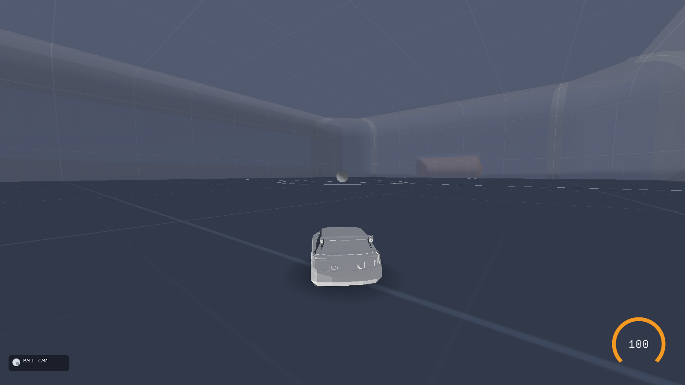
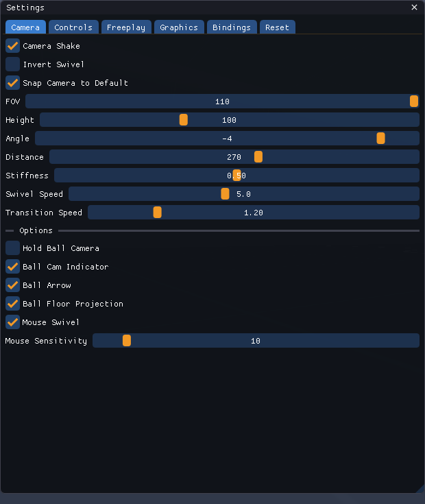
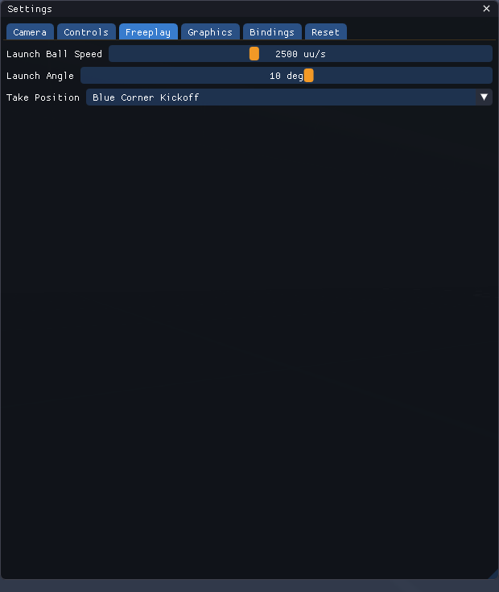
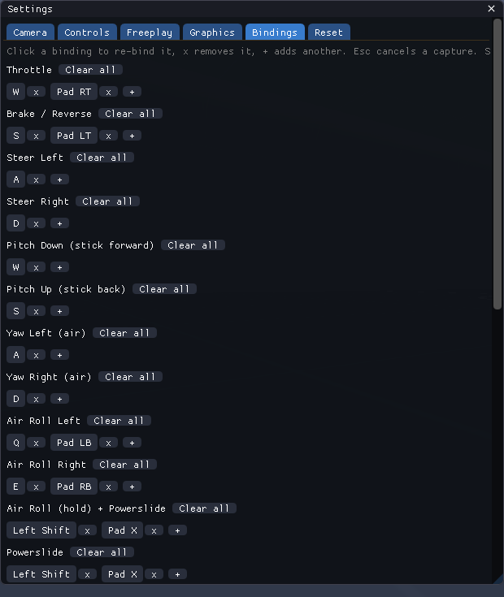
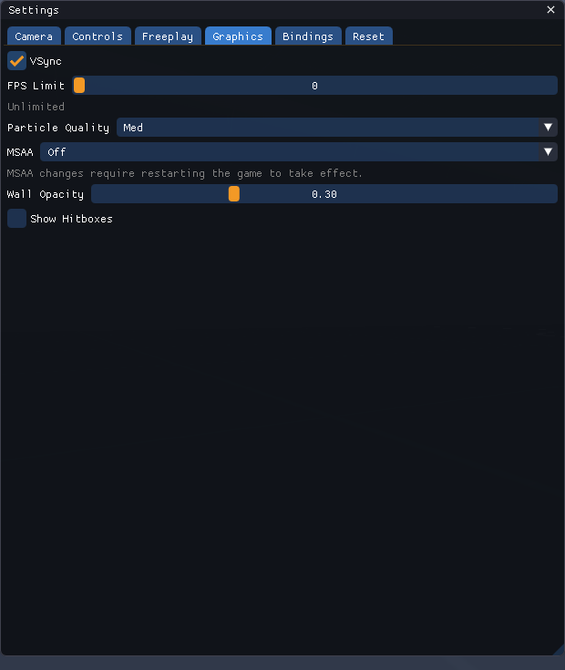

# Carballer


**A minimal, offline Rocket League freeplay trainer.** Drive, flip, dribble and
shoot in a lightweight sandbox built on the open-source Rocket League physics
simulation — with a camera, settings and control feel tuned to match the real
game.



## Features

- **RL-faithful physics** — [RocketSim] car & ball simulation on the standard
  Octane hitbox; honest flip-canceling that never half-flips for you.
- **Rocket League camera** — ball cam / car cam, RL-accurate settings ranges
  (Liquipedia) with Psyonix v1.74 defaults, instant snap-back, mouse or key swivel.
- **Freeplay toolkit** — infinite boost, launch the ball at any angle
  (−90°…+90°, straight up included), dribble mode, kickoff & corner position presets.
- **See-through walls** — walls and ceiling stay glassy like RL, with a Wall
  Opacity slider (invisible → solid).
- **Full rebinding UI** — keyboard, mouse and gamepad, including individual
  left/right stick directions.
- **Fennec body** — the printable [Thingiverse Fennec][fennec-thing] on the real
  Octane hitbox (procedural fallback included).
- **Lightweight** — flat-shaded OpenGL 3.3, MSAA & particle quality options,
  no game install required.

## Screenshots

| Settings: Camera | Settings: Freeplay |
| :---: | :---: |
|  |  |

| Settings: Bindings | Settings: Graphics |
| :---: | :---: |
|  |  |

## Build

### Requirements

- Linux with OpenGL 3.3 support
- CMake ≥ 3.16 and a C++20 compiler (GCC 12+ / Clang 15+)
- SDL2 and GLEW development packages, pkg-config, curl

```bash
# Debian / Ubuntu
sudo apt install build-essential cmake pkg-config libsdl2-dev libglew-dev curl
```

### Instructions

```bash
git clone --recurse-submodules <repository-url> carballer
cd carballer
./tools/fetch_assets.sh                            # arena collision meshes (public mirrors)
cmake -B build -DCMAKE_BUILD_TYPE=RelWithDebInfo
cmake --build build -j"$(nproc)"
./build/carballer
```

Cloned without submodules? Run `git submodule update --init --recursive` first.

`settings.json` is created in the directory you launch from — run from `build/`
to keep it out of the source tree.

## Controls

| Action | Keyboard / Mouse | Gamepad |
| :-- | :-- | :-- |
| Throttle / Brake | `W` / `S` | RT / LT |
| Steer · Yaw (air) | `A` / `D` | Left stick ← → |
| Pitch (air) | `W` / `S` | Left stick ↑ ↓ |
| Air roll left / right | `Q` / `E` | LB / RB |
| Free air roll · Powerslide | `Shift` (hold) | `X` (hold) |
| Boost | Left mouse | `B` |
| Jump | Right mouse | `A` |
| Ball Cam | `Space` | `Y` |
| Camera swivel | Arrow keys / mouse | Right stick |
| Launch Ball | `B` | Back |
| Start Dribble | `V` | LS click |
| Take Position | `T` | RS click |
| Menu | `Esc` | Start |
| Stats overlay | `F3` | — |

Everything — including each stick direction — is rebindable in the in-game
**Bindings** tab.

## Configuration

All options live in the settings menu (`Esc`): camera, controls, freeplay,
graphics and bindings. Values follow Rocket League's published ranges and
Psyonix's defaults, and are saved to `settings.json` on exit.

## Acknowledgments

- [RocketSim](https://github.com/ZealanL/RocketSim) by ZealanL — the open-source
  RL physics simulation this whole project stands on.
- [Dear ImGui](https://github.com/ocornut/imgui) by Omar Cornut — the settings UI.
- [SDL2](https://github.com/libsdl-org/SDL) — window, input and gamepad support.
- OpenGL & GLEW — rendering.
- [Rocket League](https://rocketleague.psyonix.com) by Psyonix — the game this
  trainer is modeled after; all geometry is procedural or built from publicly
  mirrored collision data, no game assets are redistributed.
- [Fennec model][fennec-thing] by Thingiverse user **PsychItsMike**
  (CC BY-NC-SA 4.0), after the original by **Adam Williams** — used for the
  drivable car body (not affiliated with or endorsed by Psyonix).
- [Liquipedia](https://liquipedia.net/rocketleague/) — camera & control setting
  ranges and defaults.
- Collision-mesh mirrors [RocketSimPy](https://github.com/pjsny/RocketSimPy),
  [rlgym-sim-rs](https://github.com/JeffA233/rlgym-sim-rs) and
  [rocket-league-gym](https://github.com/lucas-emery/rocket-league-gym) — fed to
  `tools/fetch_assets.sh`.
- Developed with [OpenCode](https://opencode.ai/), the open-source coding-agent
  CLI, using the **MiMo v2.6 Flash** model.

[fennec-thing]: https://www.thingiverse.com/thing:4195502
